# Learner Guide - AWS Certified DevOps Engineer Professional Training

**TGS Ref No:** TGS-2025054815  
**Provider:** Tertiary Infotech Academy Pte Ltd (UEN: 201200696W)  
**Version:** 1.0  
**Release date:** 10 Jul 2026

## How to Use This Guide

Complete the labs in order. Each section below mirrors the authoritative lab file, including its objectives, scenario, steps, deliverables, and checkpoint. Capture the requested evidence and follow every cost-safety instruction.

## Learning Outcomes

- Automate secure AWS software delivery workflows.
- Build and govern infrastructure as code.
- Select deployment and rollback strategies.
- Operate fleets and configuration safely.
- Design monitoring, incident response, resilience, security, and cost controls.

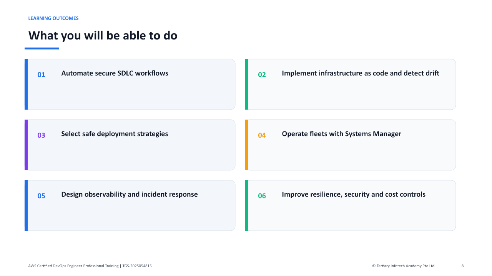

## Setup and Cost Safety

- Use the trainer-provided AWS account where available.
- Work in the instructed AWS Region.
- Never place credentials in screenshots, source files, or submissions.
- Monitor charges and delete paid resources immediately after each lab.

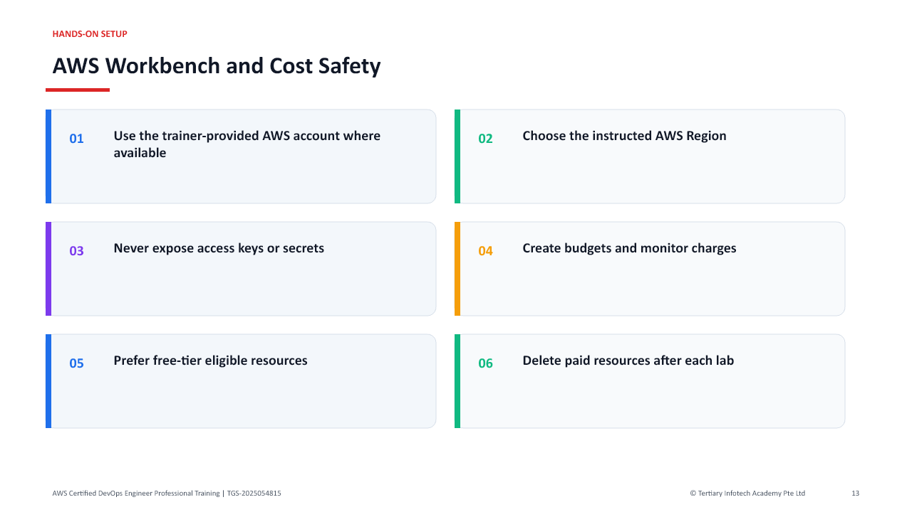

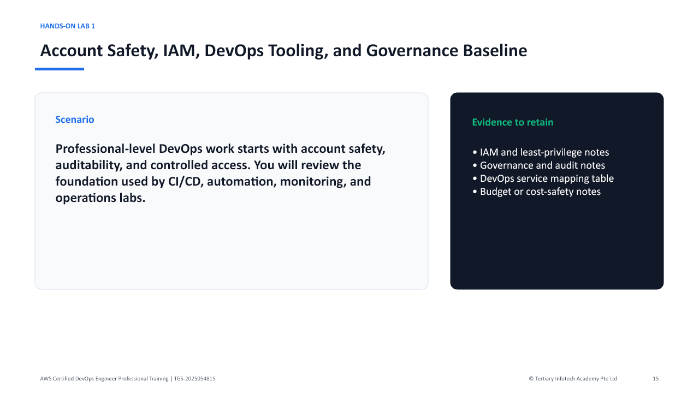

# Lab 1 - Account Safety, IAM, DevOps Tooling, and Governance Baseline

## Objectives

- Establish a safe AWS DevOps learning baseline.
- Review IAM, roles, permission boundaries, and least privilege.
- Review governance, audit, and cost-safety services.
- Map core DevOps services to SDLC activities.

## Scenario

Professional-level DevOps work starts with account safety, auditability, and controlled access. You will review the foundation used by CI/CD, automation, monitoring, and operations labs.

## Steps

1. Sign in to the AWS account assigned by your trainer.
2. Confirm the account and region.
3. Open IAM.
4. Verify MFA where permitted.
5. Review users, groups, roles, policies, and permission boundaries.
6. Review how service roles are used by CodeBuild, CodePipeline, CloudFormation, and Systems Manager.
7. Open AWS Organizations if available and review organizational units and service control policies at a high level.
8. Open CloudTrail and review Event history.
9. Open AWS Config and review resource inventory and compliance concepts.
10. Open AWS Budgets and Cost Explorer.
11. Create a budget alert only if permitted.
12. Open CodePipeline, CodeBuild, CodeDeploy, CloudFormation, Systems Manager, and CloudWatch for service awareness.
13. Create a table mapping source, build, deploy, monitor, remediate, secure, and govern activities to AWS services.
14. Save your notes.

## Deliverables

- IAM and least-privilege notes
- Governance and audit notes
- DevOps service mapping table
- Budget or cost-safety notes

## Checkpoint

You should be able to explain the governance baseline needed before automating AWS delivery and operations.

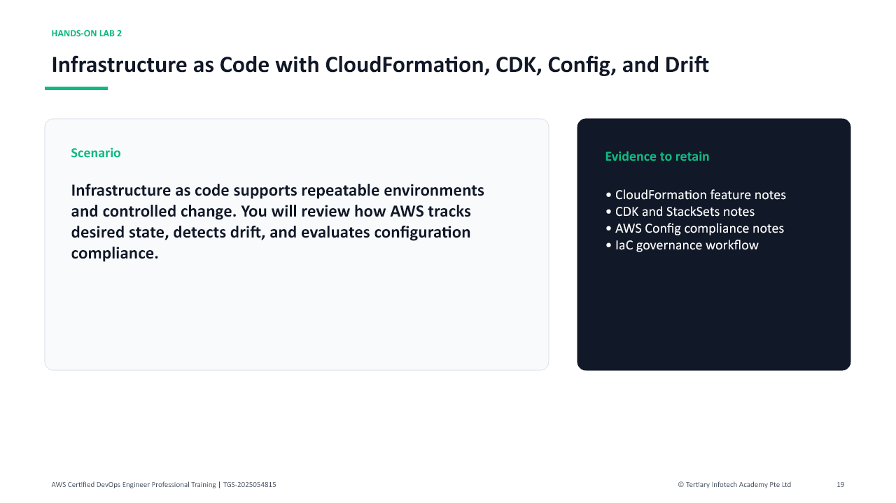

# Lab 2 - Infrastructure as Code with CloudFormation, CDK, Config, and Drift

## Objectives

- Review CloudFormation stacks, templates, change sets, and drift detection.
- Understand CDK and StackSets at a high level.
- Review AWS Config rules and compliance snapshots.
- Design an IaC governance workflow.

## Scenario

Infrastructure as code supports repeatable environments and controlled change. You will review how AWS tracks desired state, detects drift, and evaluates configuration compliance.

## Steps

1. Open CloudFormation.
2. Review stacks, templates, parameters, outputs, mappings, conditions, and resources.
3. Review change set behavior.
4. Review stack rollback and termination protection concepts.
5. Review drift detection.
6. Create a stack only if your trainer permits it.
7. Open AWS CDK documentation or service resources and review app, stack, construct, synth, and deploy concepts.
8. Open StackSets and review multi-account or multi-region deployment concepts.
9. Open AWS Config.
10. Review resource inventory and configuration timeline.
11. Review managed rules and conformance packs.
12. Create a tagging standard for environment, owner, cost center, application, and data classification.
13. Design an IaC workflow with pull request, template validation, change set, approval, deploy, drift check, and Config compliance.
14. Save your notes.

## Deliverables

- CloudFormation feature notes
- CDK and StackSets notes
- AWS Config compliance notes
- IaC governance workflow

## Checkpoint

You should be able to explain how IaC, drift detection, and Config support controlled AWS operations.

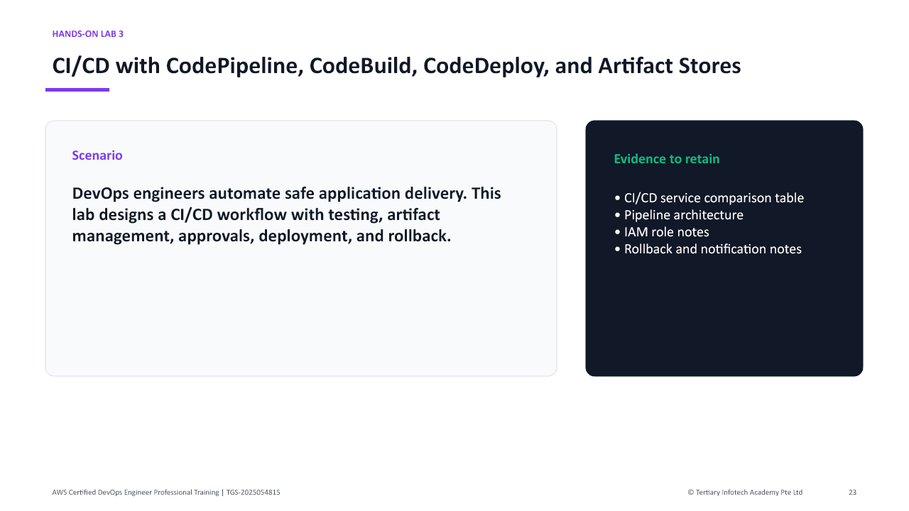

# Lab 3 - CI/CD with CodePipeline, CodeBuild, CodeDeploy, and Artifact Stores

## Objectives

- Design a CI/CD pipeline.
- Review buildspec, artifacts, test stages, approvals, and deployment stages.
- Compare CodePipeline, CodeBuild, CodeDeploy, and CodeArtifact concepts.
- Plan rollback and failure handling.

## Scenario

DevOps engineers automate safe application delivery. This lab designs a CI/CD workflow with testing, artifact management, approvals, deployment, and rollback.

## Steps

1. Open CodePipeline.
2. Review pipeline stages, actions, transitions, and approvals.
3. Open CodeBuild.
4. Review build projects, build environments, buildspec files, artifacts, reports, and logs.
5. Open CodeDeploy.
6. Review applications, deployment groups, deployment configurations, lifecycle hooks, and rollback.
7. Open CodeArtifact if available and review package repository use cases.
8. Review S3 artifact bucket concepts.
9. Create a pipeline design with source, build, unit test, integration test, security scan, package, approval, deploy, and post-deploy validation.
10. Identify IAM service roles required by each stage.
11. Identify environment variables and secrets handling.
12. Identify rollback triggers.
13. Identify notifications through SNS or EventBridge.
14. Save your pipeline design.

## Deliverables

- CI/CD service comparison table
- Pipeline architecture
- IAM role notes
- Rollback and notification notes

## Checkpoint

You should be able to explain professional CI/CD design, including artifacts, approvals, validation, and rollback.

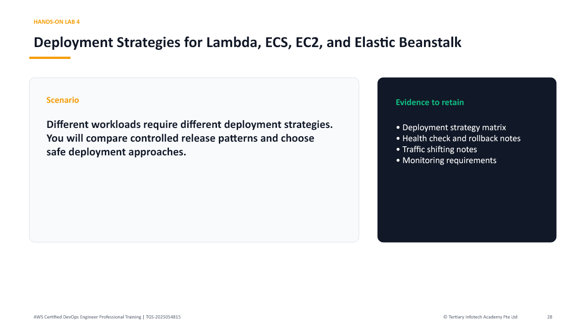

# Lab 4 - Deployment Strategies for Lambda, ECS, EC2, and Elastic Beanstalk

## Objectives

- Compare deployment strategies for different AWS compute platforms.
- Review blue/green, canary, linear, rolling, immutable, and all-at-once deployments.
- Understand traffic shifting, health checks, and rollback.
- Design a deployment plan for multiple workload types.

## Scenario

Different workloads require different deployment strategies. You will compare controlled release patterns and choose safe deployment approaches.

## Steps

1. Review Lambda versions and aliases.
2. Review Lambda traffic shifting with CodeDeploy concepts.
3. Review ECS services, task definitions, deployment controllers, and rolling updates.
4. Review blue/green deployments for ECS using CodeDeploy at a high level.
5. Review EC2 Auto Scaling rolling or immutable deployment concepts.
6. Review Elastic Beanstalk deployment policies.
7. Create a deployment strategy matrix for Lambda, ECS, EC2, and Elastic Beanstalk.
8. For each workload, choose a strategy for low-risk production releases.
9. Define health check signals.
10. Define rollback triggers.
11. Define monitoring and alarm requirements.
12. Define how feature flags or parameterized configuration could reduce risk.
13. Save your notes.

## Deliverables

- Deployment strategy matrix
- Health check and rollback notes
- Traffic shifting notes
- Monitoring requirements

## Checkpoint

You should be able to select a deployment strategy based on workload type, risk, rollback needs, and availability requirements.

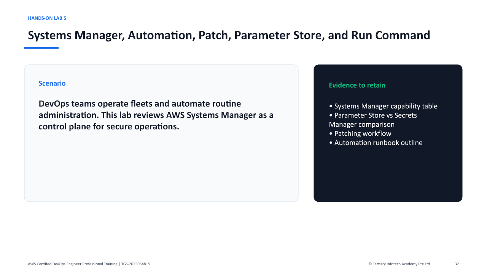

# Lab 5 - Systems Manager, Automation, Patch, Parameter Store, and Run Command

## Objectives

- Review Systems Manager operations capabilities.
- Understand Run Command, Session Manager, Automation, Patch Manager, and State Manager.
- Compare Parameter Store and Secrets Manager.
- Design fleet operations and remediation workflows.

## Scenario

DevOps teams operate fleets and automate routine administration. This lab reviews AWS Systems Manager as a control plane for secure operations.

## Steps

1. Open Systems Manager.
2. Review managed nodes and prerequisites.
3. Review Run Command.
4. Review Session Manager and why it can reduce SSH exposure.
5. Review Automation runbooks.
6. Review Patch Manager.
7. Review State Manager.
8. Review Distributor and Inventory at a high level.
9. Open Parameter Store.
10. Compare string, string list, secure string, hierarchy, and parameter policies.
11. Compare Parameter Store with Secrets Manager.
12. Design a patching workflow for a fleet of EC2 instances.
13. Design an automation runbook for restarting a failed service or collecting logs.
14. Identify IAM permissions and audit logs required for operations.
15. Save your notes.

## Deliverables

- Systems Manager capability table
- Parameter Store vs Secrets Manager comparison
- Patching workflow
- Automation runbook outline

## Checkpoint

You should be able to explain how Systems Manager supports secure fleet operations and automation.

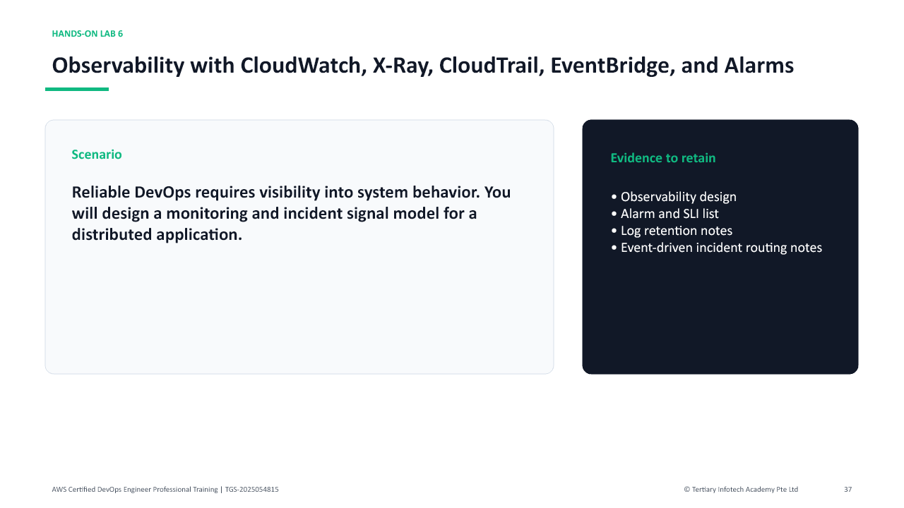

# Lab 6 - Observability with CloudWatch, X-Ray, CloudTrail, EventBridge, and Alarms

## Objectives

- Design observability for AWS applications and infrastructure.
- Use metrics, logs, traces, dashboards, and alarms conceptually.
- Review X-Ray and distributed tracing.
- Route operational events with EventBridge.

## Scenario

Reliable DevOps requires visibility into system behavior. You will design a monitoring and incident signal model for a distributed application.

## Steps

1. Open CloudWatch.
2. Review metrics, namespaces, dimensions, dashboards, and alarms.
3. Review CloudWatch Logs, log groups, metric filters, and subscription filters.
4. Review anomaly detection and composite alarms at a high level.
5. Open X-Ray.
6. Review service maps, traces, segments, subsegments, and sampling.
7. Open CloudTrail and review audit events.
8. Open EventBridge.
9. Review event rules, schedules, and targets.
10. Design a monitoring plan for a web application with API, compute, database, and queue components.
11. Define key SLIs and alarms.
12. Define log retention and search requirements.
13. Define trace sampling and troubleshooting requirements.
14. Define incident routing to SNS, Chatbot, Lambda, or Systems Manager Automation.
15. Save your notes.

## Deliverables

- Observability design
- Alarm and SLI list
- Log retention notes
- Event-driven incident routing notes

## Checkpoint

You should be able to design observability that supports troubleshooting, alerting, and automated response.

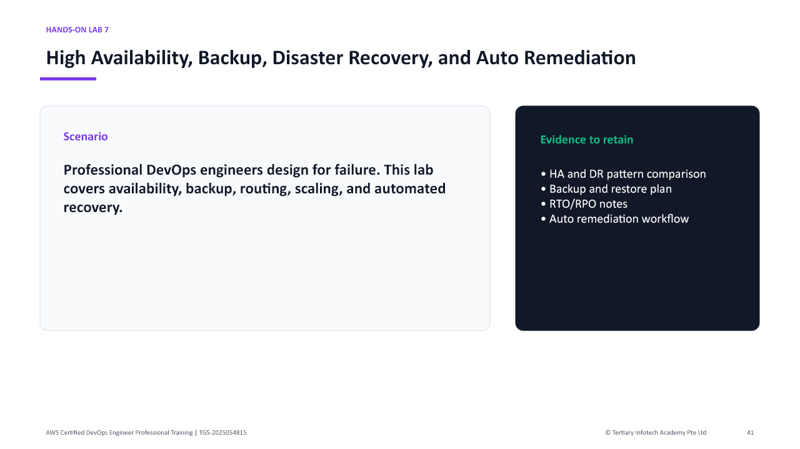

# Lab 7 - High Availability, Backup, Disaster Recovery, and Auto Remediation

## Objectives

- Review high availability and disaster recovery patterns.
- Understand backup and restore services.
- Design auto remediation workflows.
- Compare RTO, RPO, and resilience tradeoffs.

## Scenario

Professional DevOps engineers design for failure. This lab covers availability, backup, routing, scaling, and automated recovery.

## Steps

1. Review Multi-AZ and multi-region concepts.
2. Review Auto Scaling groups and scaling policies.
3. Review Elastic Load Balancing health checks.
4. Review Route 53 routing policies and health checks.
5. Open AWS Backup and review backup plans, vaults, retention, and restore concepts.
6. Review RDS backup, snapshots, Multi-AZ, and read replica concepts.
7. Review S3 versioning, replication, lifecycle, and object lock at a high level.
8. Review disaster recovery strategies: backup and restore, pilot light, warm standby, and multi-site active-active.
9. Review AWS Fault Injection Service at a high level.
10. Design an HA and DR plan for a three-tier application.
11. Define RTO and RPO targets.
12. Define alarms that trigger auto remediation.
13. Define a Systems Manager Automation or Lambda remediation action.
14. Save your notes.

## Deliverables

- HA and DR pattern comparison
- Backup and restore plan
- RTO/RPO notes
- Auto remediation workflow

## Checkpoint

You should be able to explain resilience design choices and automated recovery patterns for AWS applications.

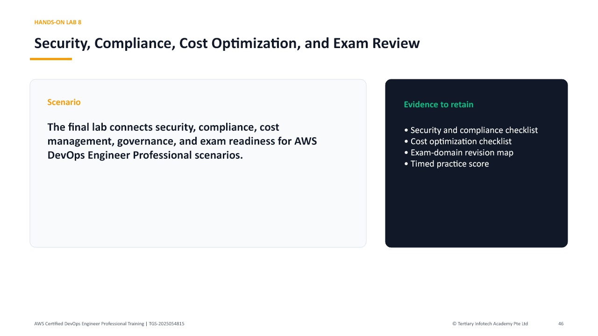

# Lab 8 - Security, Compliance, Cost Optimization, and Exam Review

## Objectives

- Review security and compliance guardrails for DevOps.
- Plan cost optimization for delivery and operations.
- Map labs to exam domains.
- Complete timed certification-style practice.

## Scenario

The final lab connects security, compliance, cost management, governance, and exam readiness for AWS DevOps Engineer Professional scenarios.

## Steps

1. Open Security Hub and review security posture concepts.
2. Open GuardDuty and review threat detection concepts.
3. Review IAM Access Analyzer and policy validation concepts.
4. Review KMS, Secrets Manager, and Parameter Store.
5. Review AWS Config rules and conformance packs.
6. Review Service Control Policies and permission boundaries at a high level.
7. Open Trusted Advisor if available.
8. Open Cost Explorer and AWS Budgets.
9. Create a cost optimization checklist for pipelines, builds, logs, compute, storage, and data transfer.
10. Create a compliance checklist for audit logs, encryption, access review, configuration drift, and change control.
11. Map each lab to exam domains.
12. Complete a timed 30-question practice set from trainer-provided questions or AWS practice resources.
13. Mark weak topics by domain.
14. Create a final revision plan.
15. Clean up temporary resources if instructed.
16. Save final notes.

## Deliverables

- Security and compliance checklist
- Cost optimization checklist
- Exam-domain revision map
- Timed practice score
- Weak-topic revision plan

## Checkpoint

You should be ready to reason through advanced AWS DevOps scenarios covering delivery, operations, resilience, security, monitoring, and governance.

## Quick Command Reference

| Command / Action | Purpose |
| --- | --- |
| `aws sts get-caller-identity` | Confirm the active AWS identity before making changes. |
| `aws cloudformation detect-stack-drift` | Start CloudFormation drift detection. |
| `aws cloudformation describe-stack-drift-detection-status` | Review drift detection status. |
| `aws ssm describe-instance-information` | Check managed-node registration. |
| `aws cloudwatch describe-alarms` | Review alarm state and configuration. |

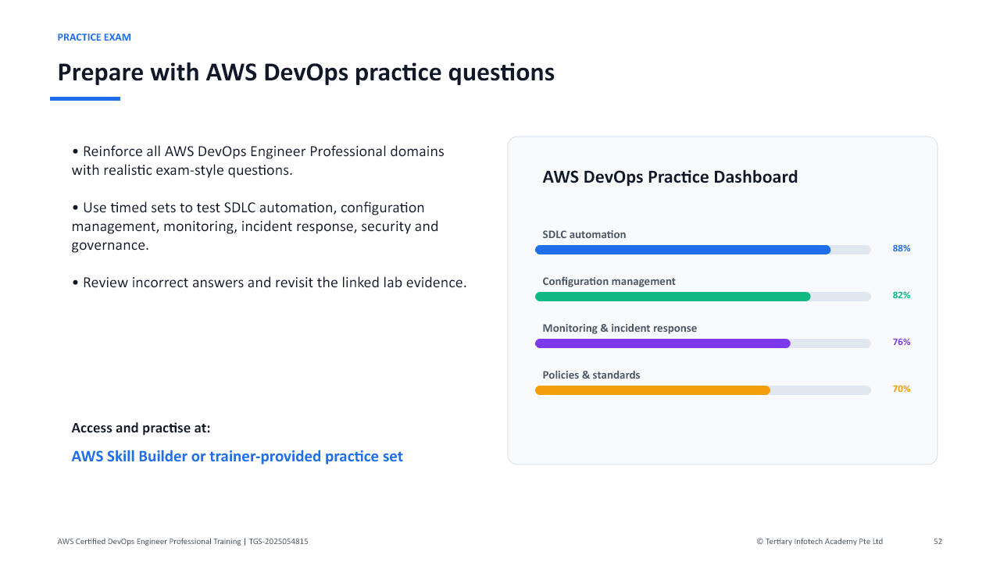

## Assessment and Support

1. Complete TRAQOM digital attendance.
2. Complete assessment digital attendance.
3. Sit the Written Assessment, then Practical Performance.
4. Submit assessment answers on the LMS.
5. Sign the Assessment Summary Record.

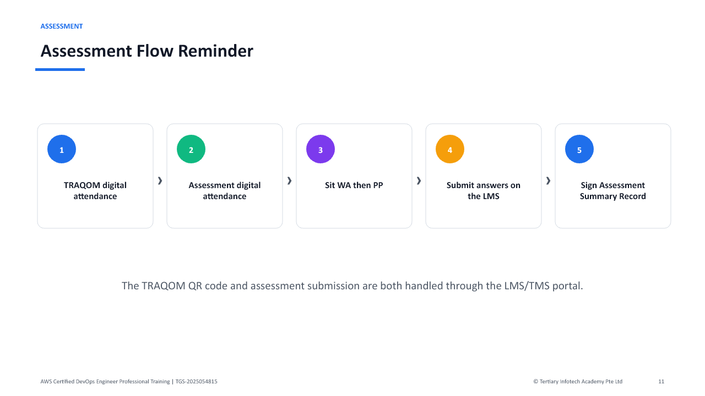

LMS: https://lms-tms.tertiaryinfotech.com/  
Support: enquiry@tertiaryinfotech.com | +65 6100 0613